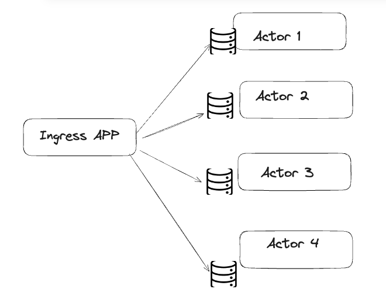

# Approach 1 for Key value store

### Controller and Deployment setup (Actor replicas) (approach1)

- Here all the data was shared and refered by all the actor replicas equally.
- We can use RAY autoscaling for scaling the KV Store serving

- Only controller to support HTTP and GraphQL protocol we are using FASTAPI and Starllete dependencies.

