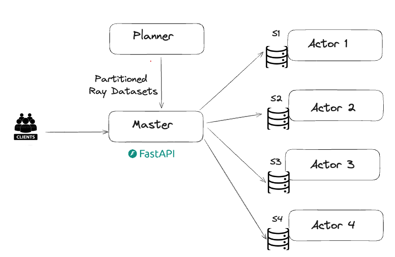

# Approach 2 for Key value store

### Controller , Router and Hash based Actor setup (approach2)

- Here all the data was partitioned by hash ranges (we are modulus of UUID4)
- Once this UUIDs are partitioned this partitioned dataset was shared to different Actors so each actors act on particular partition of the dataset not the complete dataset.
- so we have planner which plans the partitions of ray dataset (we are using ray dataset APIs to read the key value storage file in distribuitive manner)
- once the data is partitioned which is shared to KVStore Master actor which assigns partitioned dataset to different actors
- And also KVMaster node act as FASTAPI ingress APP which takes the input traffic (key) and queries the corresponding Actor which contains the value, and gives back the result to the clients.

### Pros:
- Actors are working on partitioned chunk instead of complete data
- improves latency and performance

### cons:
- Strict Validation is needed so that each actor and master combination works as expected
