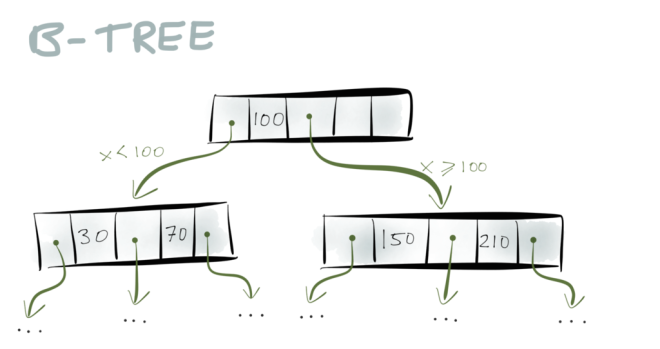

# Approach 3 for Key value store

### Distribuited Btree Alogrithm in RAY

We can Try to use B-Tree Alogrithm also here, They are a very widely used data structure for storage engines – almost all relational databases, and many non-relational databases, use them.

To summarize them briefly: a B-Tree consists of pages, which are fixed-size blocks on disk, typically 4 or 8 kB in size. When you want to look up a particular key, you start with one page, which is at the root of the tree. The page contains pointers to other pages, and each pointer is tagged with a range of keys: for example, if your key is between 0 and 100, you follow the first pointer; if your key is between 100 and 300, you follow the second pointer; and so on.

The pointer takes you to another page, which further breaks down the key range into sub-ranges. And eventually you end up at the page containing the particular key you’re looking for.

Now what happens if you need to insert a new key/value pair into a B-tree? You have to insert it into the page whose key range contains the key you’re inserting. If there is enough spare space in that page, no problem. But if the page is full, it needs to be split into two separate pages.

Some reference implementation of Distribuited Btree for Key value store usecases

paper link: https://www.site.uottawa.ca/~bochmann/Curriculum/Pub/2010%20-%20Distributed%20B-tree%20with%20Weak%20Consistency.pdf

Another promising approach can be refering this KV store implementation details:
- https://tikv.org/
- https://tikv.org/deep-dive/key-value-engine/b-tree-vs-lsm/
